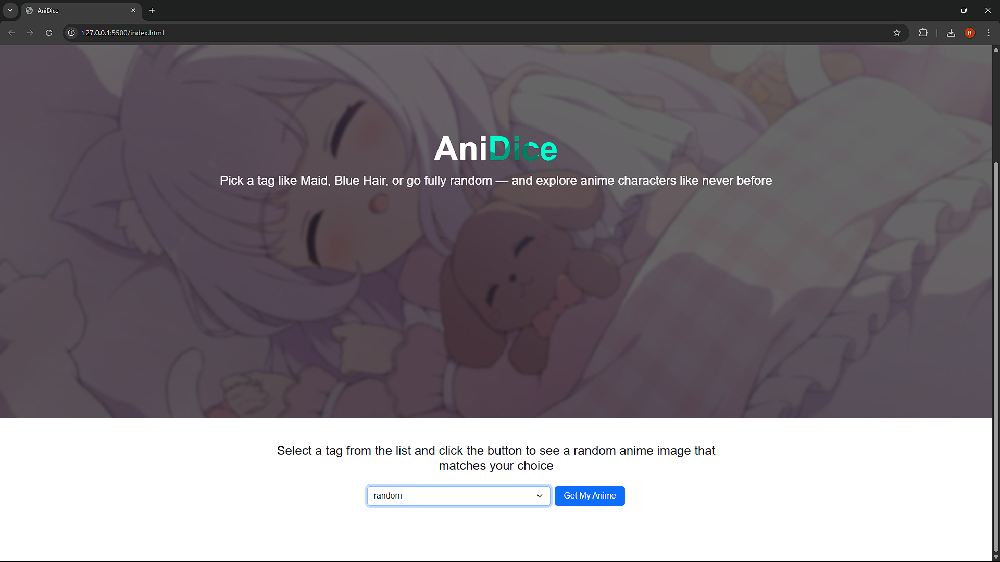

# 🎲 AniDice

A simple and beginner-friendly mini project that allows users to view and download anime images based on selected tags. For example, when a user selects the `catgirl` tag, the app will display random images of *catgirls*, along with related tags and a download button

---

## 🌐 Live Preview

You can check out the project [here](https://miawwh.github.io/anidice/)

> *Or clone the repo and open it locally (see below)*

---

## 📸 Screenshot



---

## 🧰 Technologies Used

* **HTML**
* **CSS**
* **Bootstrap 5**
* **JavaScript**
* **Axios** (or Fetch API) for fetching anime images

---

## 📦 How to Use

1. Clone this repository:

   ```bash
   git clone https://github.com/Miawwh/tagami.git
   ```

2. Open the project folder:

   ```bash
   cd tagami
   ```

3. Open `index.html` in your browser:

   ```bash
   # You can simply double-click index.html or use Live Server (VS Code)
   ```

4. Select an anime tag from the dropdown (e.g., `catgirl`) and click the **Search** button. The app will fetch and display a random anime image for that tag, along with a download option

---

## 🧪 API Used

This project uses the free and public API provided by **NekoSi Cat** for anime image retrieval

* 🔗 API Endpoint Used: `https://api.nekosia.cat/api/v1/images/tags`
* 📖 API Documentation: [NekoSi Cat API Docs](https://nekosia.cat/documentation?page=introduction)

---

## 🗂️ Project Structure

```
tagami/
├── index.html       # Main HTML file
├── style.css        # Custom styling
├── system.js        # JavaScript logic (API call, rendering results)
├── Defaul.png       # Sample screenshot
├── image.png        # Sample screenshot
└── README.md        # Project documentation
```

---

## 📣 Notes

* This project is **completely free** and **open to use** by anyone
* You’re welcome to improve, modify, or reuse this code for your own personal or educational projects
* If the API server is down or encounters an error, an appropriate message will be shown

---

## 💡 Future Improvements (Optional Ideas)

* Add pagination or multiple-image gallery per tag
* Display additional tag suggestions based on user choices
* Implement dark/light mode toggle
* Improve mobile responsiveness and accessibility

---

## 📬 Feedback or Questions?

Feel free to open an issue or start a discussion on this repo
